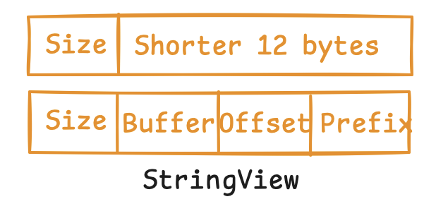

# arrow-rs中的StringView

Apache Arrow是一个高效的列式数据的内存表示，本文介绍其`StringViewArray`与`StringArray`的不同。

## StringArray简介

`StringArray`是arrow的一种基本列实例、是一列字符串数据，一个`StringArray`主要有

- 一个`nullmap`指示数据是否为null
- 一个`offset`数组指示某一行的字符串在Buffer上的位移
- 一个配备的Buffer用来存储实际的UTF8字符串信息

## 一个StringView长什么样？

`StringViewArray`中同样也有`nullmap`，但是却不使用简单的`offset`，而是用一个`StringView`来指示字符串。首先，一个`StringView`的大小为16字节，前4个字节用来表示字符串长度。剩余的12字节分两种情况，

1. 字符串编码字节数小于12时，该字符串直接内联到存放在剩余的12字节内
2. 字节数大于12时，存放buffer编号、偏移和前缀，各占用4字节。其中，buffer编号即完整字符串数据所存放的，属于该`StringViewArray`的buffer的编号；偏移即在该buffer中第几个字节开始为该字符串数据；前缀存放了字符串前4个字节的编码数据。



## StringArray vs StringViewArray

好处显而易见，如果一个Array中的字符串有大量重复，那么`StringView`就可以简单指向Buffer中的同一段数据，大大减少内存用量。如下面的示例，对于一个Array：

"Apache StringView"

"Apache DataFusion"

"Apache StringView"

"InfluxDB"

`StringViewArray`能够重复利用此前出现过的字符串，相比`StringArray`，Buffer减少了17字节（另外这里可以看出在数据量小的情况，因为`StringView`占用的内存大于一般的`OffsetSize`，如`i32, i64`，`StringView`的好处较难体现）


## StringViewArray如何构建

arrow提供了`StringViewArrayBuilder`来构建一个Array，而关键函数就是`append_value(&mut self, value: impl AsRef<T::Native>)`。

```Rust
    pub fn append_value(&mut self, value: impl AsRef<T::Native>) {
        let v: &[u8] = value.as_ref().as_ref();
        let length: u32 = v.len().try_into().unwrap();
        if length <= 12 {
            let mut view_buffer = [0; 16];
            view_buffer[0..4].copy_from_slice(&length.to_le_bytes());
            view_buffer[4..4 + v.len()].copy_from_slice(v);
            self.views_builder.append(u128::from_le_bytes(view_buffer));
            self.null_buffer_builder.append_non_null();
            return;
        }

        // Deduplication if:
        // (1) deduplication is enabled.
        // (2) len > 12
        if let Some((mut ht, hasher)) = self.string_tracker.take() {
            let hash_val = hasher.hash_one(v);
            let hasher_fn = |v: &_| hasher.hash_one(v);

            let entry = ht.entry(
                hash_val,
                |idx| {
                    let stored_value = self.get_value(*idx);
                    v == stored_value
                },
                hasher_fn,
            );
            match entry {
                Entry::Occupied(occupied) => {
                    // If the string already exists, we will directly use the view
                    let idx = occupied.get();
                    self.views_builder
                        .append(self.views_builder.as_slice()[*idx]);
                    self.null_buffer_builder.append_non_null();
                    self.string_tracker = Some((ht, hasher));
                    return;
                }
                Entry::Vacant(vacant) => {
                    // o.w. we insert the (string hash -> view index)
                    // the idx is current length of views_builder, as we are inserting a new view
                    vacant.insert(self.views_builder.len());
                }
            }
            self.string_tracker = Some((ht, hasher));
        }

        let required_cap = self.in_progress.len() + v.len();
        if self.in_progress.capacity() < required_cap {
            self.flush_in_progress();
            let to_reserve = v.len().max(self.block_size.next_size() as usize);
            self.in_progress.reserve(to_reserve);
        };
        let offset = self.in_progress.len() as u32;
        self.in_progress.extend_from_slice(v);

        let view = ByteView {
            length,
            prefix: u32::from_le_bytes(v[0..4].try_into().unwrap()),
            buffer_index: self.completed.len() as u32,
            offset,
        };
        self.views_builder.append(view.into());
        self.null_buffer_builder.append_non_null();
    }
```

大致逻辑如下：

1. 检查value大小，如果小于12，直接内联并制作一个view，使用成员`views_builder`加入views中
2. 若大于12，则会使用哈希方法检查是否在buffer中已有该字符串，如有则直接根据所在位置制作一个view并添加
3. 若不存在这个字符串，就会尝试添加进buffer，此处如果buffer达到指定大小，则会保存起来作为只读“历史buffer”，以便GC。

当然，这是从零构建一个`StringViewArray`的方法，我们还可以直接通过`generic_view_array::new_unchecked`方法来不安全地直接构造一个Array，具体见下文。

## 使用StringViewArray优化`SUBSTR`方法

`substr(str, start, [count])`可以帮助我们获得字符串的指定字串，因为`substr`的结果一定是原字符串的子集，那么如果输入的`DataType`是`StringViewArray`的话，我们就可以直接将原本的所有buffer拷贝作为新Array的buffer，同时直接操作每个`StringView`。这样做的好处是：首先，使用`StringViewArray`带来了节约内存的好处；其次，直接复制所有buffer相比通过此前`generic_array_builder`一次次`append_value`更高效。虽然buffer可能暂时会有无用的部份，但是在GC过程中，会自动把无用的部份回收掉。

下面列举一个示例函数用于手动收集view和构造`nullmap`以便在`new_unchecked`中使用：

```rust
/// Make a `u128` based on the given substr, start(offset to view.offset), and
/// push into to the given buffers
fn make_and_append_view(
    views_buffer: &mut Vec<u128>,
    null_builder: &mut NullBufferBuilder,
    raw: &u128,
    substr: &str,
    start: u32,
) {
    let substr_len = substr.len();
    let sub_view = if substr_len > 12 {
        let view = ByteView::from(*raw);
        make_view(substr.as_bytes(), view.buffer_index, view.offset + start)
    } else {
        // inline value does not need block id or offset
        make_view(substr.as_bytes(), 0, 0)
    };
    views_buffer.push(sub_view);
    null_builder.append_non_null();
}

// Somewhere else:
...
		let views_buf = ScalarBuffer::from(views_buf);
    let nulls_buf = null_builder.finish();
    // Safety:
    // (1) The blocks of the given views are all provided
    // (2) Each of the range `view.offset+start..end` of view in views_buf is within
    // the bounds of each of the blocks
    unsafe {
        let array = StringViewArray::new_unchecked(
            views_buf,
            string_view_array.data_buffers().to_vec(),
            nulls_buf,
        );
        Ok(Arc::new(array) as ArrayRef)
    }
...
```

